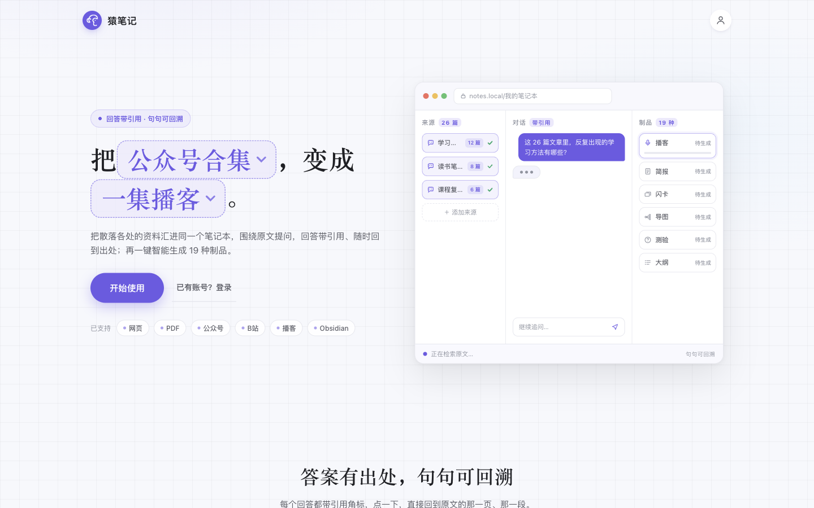
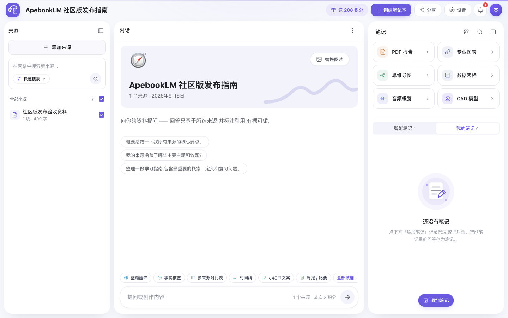
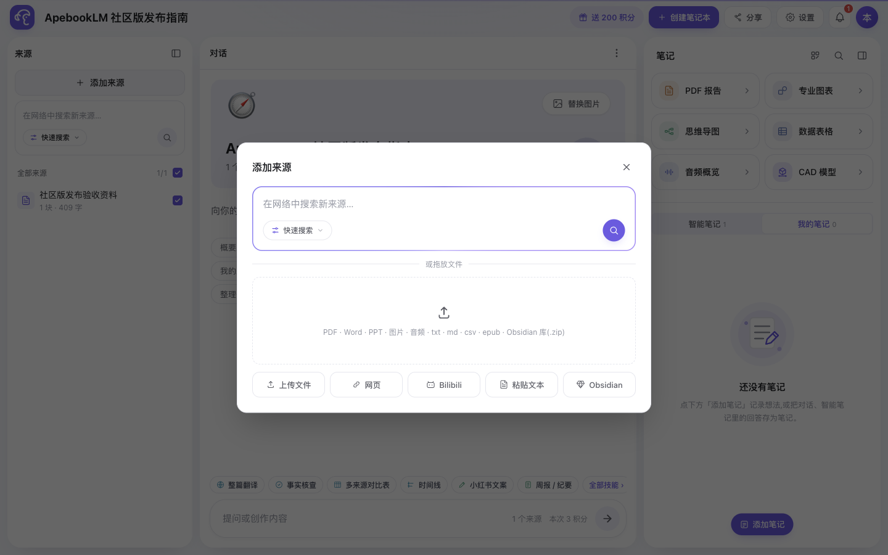
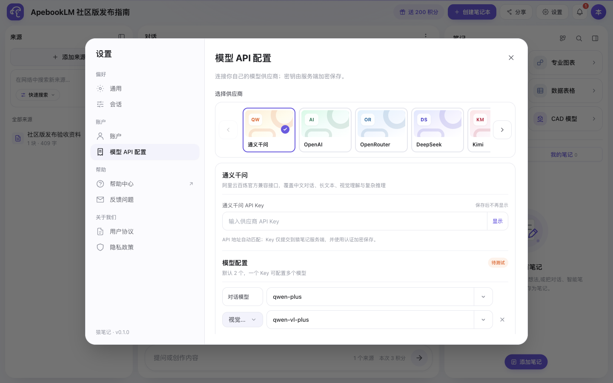
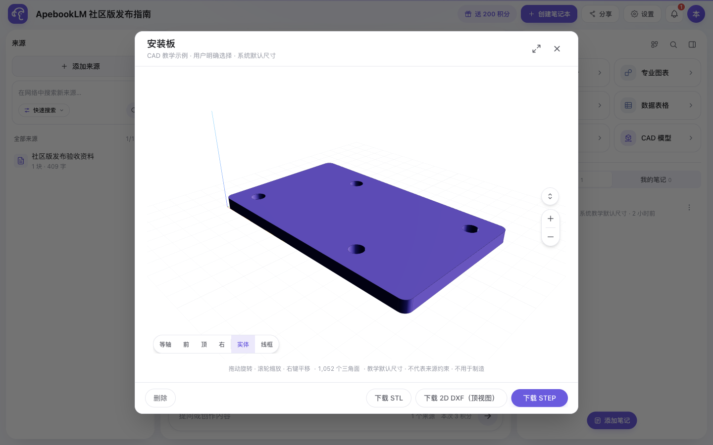

<p align="center">
  
</p>

<h1 align="center">ApebookLM</h1>

<p align="center"><strong>A self-hosted research workspace for Chinese source material.</strong></p>

<p align="center">Bring your documents together. Ask questions with source citations.<br>Turn what you learn into notes, reports, and reusable outputs.</p>

<p align="center">
  <a href="README.md">简体中文</a> · English ·
  <a href="https://github.com/Pvigors/ApebookLM/releases/tag/v0.1.0">v0.1.0 release</a> ·
  <a href="docs/SELF_HOSTING.md">Self-hosting guide</a> ·
  <a href="https://pvigors.github.io/ApebookLM/">Guided preview</a> ·
  <a href="https://github.com/Pvigors/ApebookLM/releases/download/v0.1.0/apebooklm-intro-zh-60s.mp4">60-second overview</a> ·
  <a href="CONTRIBUTING.md">Contribute</a>
</p>



ApebookLM (猿笔记) brings source collection, retrieval, notes, and content generation into one notebook. It is built around Chinese-language research workflows: PDFs, web pages, WeChat articles, Bilibili links, and the documents you already have.

The application interface is currently **Simplified Chinese**. The [guided preview](https://pvigors.github.io/ApebookLM/) has Chinese and English explanations with real screenshots; it does not accept documents or call models. Use the self-hosted community edition for the full application. There is no desktop installer.

> ApebookLM is an independent open-source project. It is not affiliated with, authorized by, or partnered with Google or NotebookLM.

## From sources to something you can use

1. **Import material.** Add documents, links, images, audio, pasted text, or an Obsidian vault ZIP.
2. **Choose your evidence.** Select the sources to use for each question or generation task.
3. **Follow citations.** Answers can link to passages in the imported source text, so you can inspect the evidence behind a claim.
4. **Keep and reuse the result.** Save notes, generate reports and other outputs, and export them for your next step.



| Capability | What is available |
| --- | --- |
| Sources | PDF, DOCX, PPTX, EPUB, TXT/Markdown, CSV, images, audio, web pages, WeChat articles, Bilibili/YouTube links, pasted text, and Obsidian ZIP |
| Retrieval and citations | Local Chinese embeddings; source selection; citations with source text, character positions, and a content hash |
| Notes | Rich-text notes; save conversations and supported text outputs as notes; turn notes into sources |
| Generated outputs | Reports, charts, mind maps, tables, audio, and CAD; administrators can enable additional types such as slides, quizzes, flashcards, video, and whiteboards |
| Export | Depending on the output: Markdown, Obsidian ZIP, PDF, XLSX, PPTX, MP3, MP4, PNG, `.excalidraw`, `.drawio`, STEP, STL, and DXF |
| Access | Private notebooks by default; owner/editor/viewer roles; public read-only sharing |
| Operations | PostgreSQL persistence, background jobs, administrator controls, usage accounting, health checks, and backup guidance |

The code defines 19 output types. New instances expose six core tiles by default: PDF reports, charts, mind maps, tables, audio overviews, and CAD. Availability depends on administrator settings and configured services; the infographic type is retained for existing outputs, not offered as a new generation entry point.

<table>
  <tr>
    <td width="50%" valign="top">
      
      <br><sub>Collect different kinds of source material in one notebook.</sub>
    </td>
    <td width="50%" valign="top">
      
      <br><sub>Choose a supported provider and models for your personal API configuration.</sub>
    </td>
  </tr>
</table>

## Self-hosted, with a choice of models

Deployers configure the instance's model service through an OpenAI-compatible API. Individual users can also bring their own key (BYOK) from the built-in provider catalog: Qwen, OpenAI, OpenRouter, DeepSeek, Kimi, Zhipu GLM, xAI, or SiliconFlow.

Personal keys are encrypted on the server with AES-256-GCM. They apply to notebooks the user owns that are private and have no collaborators, and to research requests the user explicitly initiates. Shared notebooks, public notebooks, automatic source parsing, and system tasks use the instance's model configuration. Personal settings do not accept arbitrary base URLs. See [model API configuration](docs/user-model-api-config.md) for details.

Business data lives in your PostgreSQL database and persistent media/CAD volumes. **Self-hosting does not automatically make every operation local:** configured model, search, speech, or document-processing providers may receive the text and instructions needed for a request. Local embeddings support a verified offline cache; fully offline use also requires compatible local services and disabling online features.

## Quick start with Docker

An interactive configuration generator and a separate image-based Compose setup are also available in [the prebuilt-image guide](docs/QUICKSTART.md). Use only image tags listed in a successful publication record; the existing v0.1.0 source archive does not contain these new tools.

You need Docker 24+, Docker Compose v2, and Node.js 20 to generate the initial administrator configuration on your host. A host with at least 4 CPU cores and 8 GB RAM is recommended when running CAD. Allow for container builds and initial model downloads; setup time depends on your machine and network.

### 1. Get the source

```bash
git clone --branch v0.1.0 --depth 1 https://github.com/Pvigors/ApebookLM.git
cd ApebookLM
cp .env.example .env
```

### 2. Configure the instance

Edit `.env`. At a minimum, set the following values; replace every placeholder:

```dotenv
POSTGRES_PASSWORD=<unique URL-safe random password, at least 24 characters>
DATABASE_URL=postgres://apebooklm:<the same database password>@db:5432/apebooklm
OPENAI_API_KEY=<your instance model provider key>
MODEL_API_CONFIG_SECRET=<independent 64-character hex secret>
EXPORT_FP_SECRET=<another independent random secret>
```

Run `openssl rand -hex 32` separately to generate each random secret. Keep `POSTGRES_USER`, `POSTGRES_PASSWORD`, and `POSTGRES_DB` consistent with `DATABASE_URL`. The startup check rejects weak or inconsistent database credentials.

The current code defaults to Qwen's DashScope compatible endpoint, `qwen-plus` for chat, and `qwen-vl-plus` for vision. **The `OPENAI_` variable names do not mean the default endpoint is OpenAI.** For a different provider, also set `OPENAI_BASE_URL`, `OPENAI_CHAT_MODEL`, and `OPENAI_VISION_MODEL` to that provider's compatible endpoint and available model identifiers. A vision-capable model is needed for features such as image understanding and scanned-PDF OCR.

### 3. Create the first administrator

Choose an administrator password of 16–256 characters, then run:

```bash
read -s ADMIN_CONFIG_PASSWORD
export ADMIN_CONFIG_PASSWORD
node scripts/generate-admin-password-config.mjs --username admin --display-name Administrator
unset ADMIN_CONFIG_PASSWORD
```

Paste the three generated environment-variable lines into `.env`. The password is not placed in command arguments; do not commit the configuration file. No fixed administrator account is created automatically.

### 4. Start and verify

```bash
chmod 600 .env
docker compose run --rm config-check
docker compose up -d --build
docker compose ps
curl -fsS http://127.0.0.1:3000/api/health
docker compose exec web node scripts/embed-health.mjs
```

Open [the local administrator login](http://localhost:3000/admin-login?next=/), sign in, and return to the workspace. The application uses accounts; the local administrator route lets you begin without configuring SMS or WeChat login.

The embedding health check downloads and verifies the Chinese embedding model on first use. Audio transcription also needs a local ASR model download on first use. Prepare caches in advance on restricted networks. Database health alone does not establish that retrieval is ready.

Compose binds to `127.0.0.1:3000` by default. Before exposing an instance publicly, configure a TLS reverse proxy and set `PUBLIC_ORIGIN` to its exact HTTPS origin. Back up the database and both media volumes together.

For offline embedding caches, optional services, upgrades, and recovery, see the [self-hosting guide](docs/SELF_HOSTING.md) and [configuration reference](docs/CONFIGURATION.md). Detailed operational documentation is currently in Chinese.

## An additional capability: constrained CAD generation

For a clearly specified object, dimensions, and constraints, ApebookLM can generate supported CAD geometry from selected sources, a prompt, or a fixed template. A separate worker produces a browser preview and STEP/STL files plus a 2D DXF top-view projection. STEP output is re-read with Replicad and independently with FreeCAD.



This is design and teaching assistance. Geometry validation is **not manufacturing certification**. Current CAD support does not cover arbitrary complex assemblies, freeform surfaces, BIM, sheet-metal unfolding, GD&T, CAM, BOMs, or simulation. Robot and car templates are conceptual layouts. DXF exports contain top-view edges in millimeters, without dimensions, tolerances, title blocks, or hidden-line removal. See the [CAD scope and limitations](docs/cad-mvp.md).

## Know the boundaries

- **Check the evidence.** A citation helps you inspect an answer; it does not guarantee the answer is correct. Import quality and model behavior still matter.
- **Links depend on the source site.** Bilibili/YouTube imports use available subtitles or page extraction. Access restrictions can prevent complete extraction; some Bilibili sources require a configured login cookie. Local MP4/MOV/MKV/AVI video-source uploads are not supported.
- **Services have costs.** The community edition has no payment or order modules. Model and other service providers may charge you. In-app credits are instance resource-accounting units, not money.
- **Share deliberately.** Logged-in users copying a public notebook receive its source text and retrieval chunks. Only publish material you have the right to redistribute. Anonymous public responses do not expose CAD specifications or manufacturing files.
- **Exports differ.** An Obsidian-friendly Markdown ZIP includes notes, text-convertible outputs, and a source list. Download CAD and native whiteboard files separately from their viewers.

## Develop and contribute

The stack is Next.js 15, React 19, TypeScript, and PostgreSQL 16. For local development, use Node.js 20, a dedicated PostgreSQL database, and the configuration described above:

```bash
npm ci
cp .env.example .env.local
# Configure .env.local, including your local DATABASE_URL, before starting.
npm run dev
```

Read [CONTRIBUTING.md](CONTRIBUTING.md) and [AGENTS.md](AGENTS.md) before submitting a change. The required checks are TypeScript, the test suite, the public-release scan, and a production build. Tests require a separate PostgreSQL admin connection with `CREATEDB` permission via `PG_ADMIN_URL`; never point tests at a development or production business database.

Questions, reproducible bugs, and workflow feedback are welcome in [GitHub Issues](https://github.com/Pvigors/ApebookLM/issues/new/choose). For vulnerabilities, use the private reporting process in [SECURITY.md](SECURITY.md).

## License

Code is licensed under [AGPL-3.0-only](LICENSE). See [NOTICE.md](NOTICE.md) for third-party notices, [TRADEMARKS.md](TRADEMARKS.md) for brand-use terms, and [ASSET_LICENSES.md](ASSET_LICENSES.md) for image assets.
